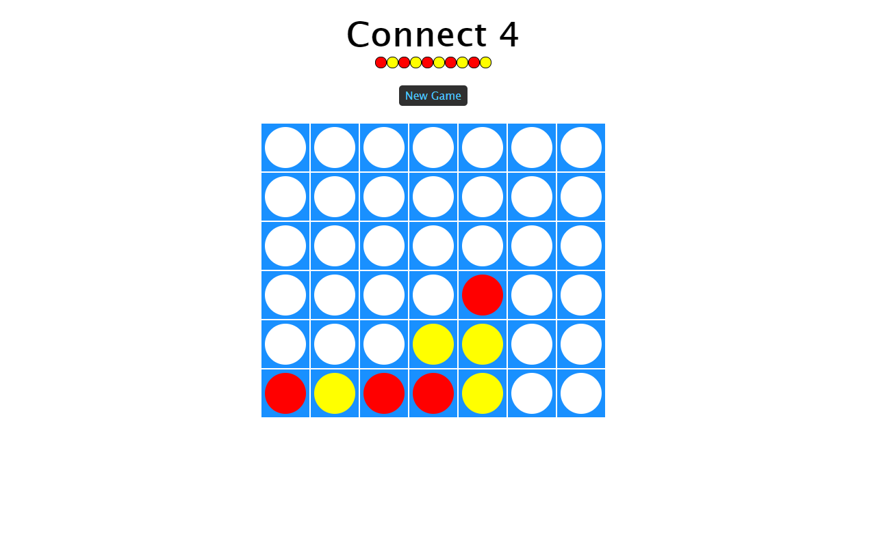

[](https://travis-ci.org/mozammal/connect-four-server)
## connect four web socket server in spring boot 
## Algorithm: Alpha Beta pruning with simple heuristic for evaluation function 

## You can play online with computer at: https://mozconnect4game.herokuapp.com 


## Requirements

For building and running the application you need:

- [JDK 1.8](http://www.oracle.com/technetwork/java/javase/downloads/jdk8-downloads-2133151.html)
- [Maven 3](https://maven.apache.org)
- [Docker](https://www.docker.com)
- [Docker Compose](https://docs.docker.com/compose/)


## Running the application locally

clone the repo with the command given below: 
```shell
git clone https://github.com/mozammal/connect-four-server.git
```


One way to run this application is to use docker-compose from the command line
(tested on ubuntu 18.04.1):

```shell

cd  connect-four-server
mvn clean package
sudo docker-compose up -d
```

One way to stop this application is to use docker-compose from the command line
(tested on ubuntu 18.04.1):

```shell
cd  tictactoe-server
sudo docker-compose stop

```

The can now play the connect four game at the following url 
- http://localhost:3000


## Enjoy beating the computer!
